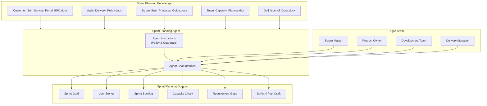
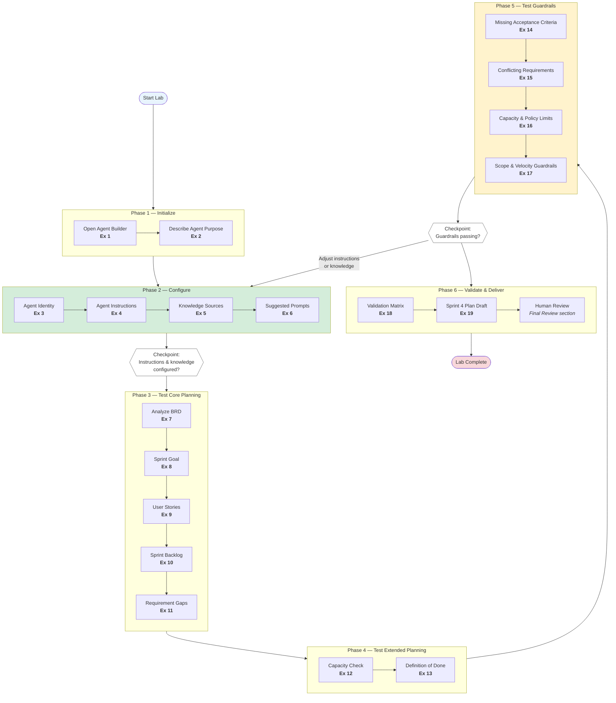
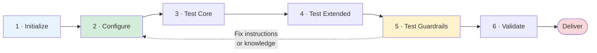

# Lab 03: Build a Sprint Planning Agent Using Microsoft 365 Copilot

| | |
|---|---|
| **Duration** | 60–75 minutes |
| **Level** | Beginner |
| **Audience** | Scrum Masters, Product Owners, Agile Coaches, Delivery Managers, Business Analysts, Project Teams |
| **Technology** | Microsoft 365 Copilot Agent Builder |
| **Coding Required** | No |

---

## Lab Overview

In this hands-on lab, you build a **Sprint Planning Agent** using Microsoft 365 Copilot Agent Builder.

Your agile delivery team needs to plan **Sprint 4** for the **Customer Self-Service Portal**. Today, sprint planning requires manually reading a product BRD, checking team capacity, applying delivery policy, and converting requirements into a structured sprint plan. You will create an agent that helps the team:

- Understand a product BRD and extract sprint-ready requirements
- Propose a sprint goal aligned with priority requirements
- Convert requirements into user stories with acceptance criteria
- Build a sprint backlog that respects team capacity and delivery policy
- Identify missing information, conflicts, and items requiring Product Owner confirmation
- Produce a complete sprint plan draft for team review

The agent must preserve source requirements and clearly distinguish verified BRD content from proposed planning assumptions.

You follow a **six-phase agent-building lifecycle**—each phase maps to one or more exercises in this lab. Configure instructions and knowledge **before** generating sprint plans; guardrail tests in Phase 5 only work if Phases 1–2 are done correctly.

---

## Learning Objectives

After completing this lab, you will be able to:

- Create a purpose-built agent for agile sprint planning
- Connect a product BRD, delivery policy, and best-practice guides as agent knowledge
- Write agent instructions that enforce capacity and policy constraints
- Generate a sprint goal and user stories from a BRD
- Map requirements to a sprint backlog with story points
- Apply Definition of Done and team capacity limits
- Identify missing acceptance criteria and ambiguous requirements
- Handle conflicting requirements without silently choosing one
- Label proposed estimates and planning assumptions appropriately
- Validate an agent-generated sprint plan against source documents
- Understand human review requirements before sprint commitment

---

## Business Context

### Use Case: Sprint Planning Agent

Contoso Digital is delivering the **Customer Self-Service Portal**. The product owner has supplied a BRD for upcoming features. The scrum team is preparing **Sprint 4** and needs a structured sprint plan that includes:

| Planning Element | Source |
|------------------|--------|
| Product requirements | Customer Self-Service Portal BRD |
| Sprint rules and limits | Agile Delivery Policy |
| Story writing and estimation guidance | Scrum Best Practices Guide |
| Team availability and capacity | Team Capacity Planner |
| Completion criteria | Definition of Done |

Today, the scrum master and product owner manually consolidate these sources into sprint planning documents. This is time-consuming and can produce inconsistent plans.

### Business Objectives

You have been asked to create an AI agent that helps:

| Role | Need |
|------|------|
| **Scrum Master** | Facilitate sprint planning with a structured draft plan |
| **Product Owner** | Review requirement coverage and priority alignment |
| **Development Team** | Understand proposed stories, estimates, and sprint goal |
| **Delivery Manager** | Confirm plan respects capacity and delivery policy |

### Agent Capabilities

Your agent should be capable of:

- **Analyzing** a product BRD and summarizing sprint-relevant requirements
- **Proposing** a sprint goal based on Must/Should priority requirements
- **Creating** user stories with acceptance criteria where source information supports them
- **Building** a sprint backlog with story point estimates using team capacity
- **Applying** Agile Delivery Policy limits (sprint length, max items, estimation scale)
- **Referencing** Definition of Done for each proposed story
- **Identifying** missing acceptance criteria, ambiguous scope, and conflicting requirements
- **Producing** a complete sprint plan draft for team review

### Agent Guardrails

The agent must **not**:

- Invent requirements not present in the BRD
- Invent acceptance criteria when the BRD does not provide them
- Invent historical team velocity when it is not in approved sources
- Commit more backlog items than policy allows
- Exceed recorded team capacity without flagging the overrun
- Silently resolve conflicting requirements
- Present the sprint plan as approved or committed without team review
- Assign story points as facts when they are planning proposals

---

## Prerequisites

### Microsoft 365 Access

- Microsoft work or school account
- Microsoft 365 Copilot access
- Access to Agent Builder
- Access to the knowledge sources supplied for the lab

### Browser

Use a current version of:

- Microsoft Edge (recommended)
- Google Chrome

### Lab Files

Your trainer should provide a fictional knowledge pack in a folder named **Sprint Planning Knowledge**:

| File | Description |
|------|-------------|
| `Sprint_Planning_Agent_BRD.docx` | Agent business requirements |
| `Customer_Self_Service_Portal_BRD.docx` | Product BRD for Sprint 4 planning |
| `Agile_Delivery_Policy.docx` | Organizational sprint delivery policy |
| `Scrum_Best_Practices_Guide.docx` | Story writing and estimation guidance |
| `Team_Capacity_Planner.xlsx` | Team roster and Sprint 4 capacity |
| `Definition_of_Done.docx` | Definition of Done checklist |

> Use only fictional or approved sanitized information for the training lab.

---

## Expected Results

At the end of the lab, you will have a working **Sprint Planning Agent** capable of supporting conversations such as:

| User Question | Expected Agent Response |
|---------------|-------------------------|
| Summarize the requirements relevant to Sprint 4. | Source-backed requirement summary with priorities |
| What should our sprint goal be? | Goal based on Must/Should requirements from BRD |
| Create user stories for the Must-have requirements. | Stories with AC where BRD provides them; gaps flagged |
| Build a sprint backlog within team capacity. | Backlog ≤ 34 points and ≤ 7 items per policy |
| What requirements have missing acceptance criteria? | REQ-05 and others flagged—not invented |
| What is the default notification channel? | Both conflicting source values shown |
| Prepare the full Sprint 4 plan. | Complete draft plan with professional-review notice |

---

## Agent Architecture

The agent connects approved planning sources to sprint planning outputs through configured instructions and guardrails:

---

## Lab Workflow

The lab follows a structured agent-building lifecycle from requirement to human review. Work through **six phases** in order—do not generate a full sprint plan until instructions and knowledge sources are fully configured.

### Workflow at a Glance

| Phase | Focus | Exercises | Agent Builder Area |
|:-----:|-------|:---------:|:------------------:|
| **1** | Initialize | 1–2 | Agent creation |
| **2** | Configure | 3–6 | Identity, instructions, knowledge, prompts |
| **3** | Test Core Planning | 7–11 | BRD analysis, goal, stories, backlog |
| **4** | Test Extended Planning | 12–13 | Capacity, DoD, ceremonies |
| **5** | Test Guardrails | 14–17 | Missing AC, conflicts, capacity, scope |
| **6** | Validate & Deliver | 18–19 | Validation matrix + full sprint plan |

### End-to-End Workflow

### Phase Summary

| Phase | What You Do | Why It Matters |
|:-----:|-------------|----------------|
| **1 · Initialize** | Open Agent Builder and describe the sprint planning agent | Establishes purpose before configuration |
| **2 · Configure** | Set identity, instructions, knowledge, and starter prompts | Policy and BRD grounding define plan quality—not chat alone |
| **3 · Test Core** | Analyze BRD, propose goal, create stories and backlog | Validates the primary sprint planning workflow |
| **4 · Test Extended** | Verify capacity alignment and Definition of Done | Ensures the plan is feasible and complete |
| **5 · Test Guardrails** | Probe missing AC, conflicts, capacity overruns, invented velocity | Validates responsible planning behavior |
| **6 · Validate & Deliver** | Run validation matrix and produce full Sprint 4 plan | Ensures the agent output is ready for team review |

> **Trainer tip:** The dotted loop from Phase 5 back to Phase 2 is intentional. If guardrail tests fail, refine **instructions** or verify **knowledge sources**—not just re-prompt in chat.

---

## Exercises

### Exercise 1 — Open Microsoft 365 Copilot Agent Builder

**Estimated time:** 5 minutes

#### Step 1 — Sign In

1. Open Microsoft Edge or Chrome.
2. Open Microsoft 365 Copilot using the environment provided by your trainer.
3. Sign in with your work or school account.

#### Step 2 — Open Agents

1. From Microsoft 365 Copilot, open **Agents**.
2. Look for the option to create a new agent.
3. Select the option to create a **New agent**.

> Depending on your organization's Microsoft 365 configuration, the exact placement of the create-agent entry point can vary.

**Checkpoint:** You should be in the agent creation experience. Do not configure knowledge yet.

---

### Exercise 2 — Describe the Agent

**Estimated time:** 5 minutes

In the agent creation experience, describe the agent:

> Create a Sprint Planning Agent for Scrum Masters, Product Owners and agile delivery teams.
>
> The agent should use an approved product BRD, agile delivery policy, scrum best practices, team capacity information and Definition of Done to help plan Sprint 4 of the Customer Self-Service Portal.
>
> It should produce structured sprint planning outputs including sprint goal, user stories, sprint backlog and capacity checks.
>
> It must preserve source requirements and must not invent missing acceptance criteria, velocity or capacity information.

Submit the description.

---

### Exercise 3 — Configure Agent Identity

**Estimated time:** 5 minutes

Review the configuration Copilot proposes. Set or confirm:

**Name:** Sprint Planning Agent

**Description:**

> Helps agile teams plan sprints by converting approved BRD requirements into sprint goals, user stories and backlog drafts using delivery policy, team capacity and Definition of Done.

**Checkpoint:** A user seeing the agent name and description should immediately understand its purpose.

---

### Exercise 4 — Configure Agent Instructions

**Estimated time:** 10 minutes

Locate the **Instructions** section and enter:

> You are a Sprint Planning Agent supporting Scrum Masters, Product Owners and agile delivery teams.
>
> Use only configured approved knowledge sources when planning sprints.
>
> PRESERVE SOURCE REQUIREMENTS
>
> Preserve requirement IDs, priority (Must/Should/Could), descriptions and acceptance criteria exactly as stated in the BRD.
>
> Never invent requirements, acceptance criteria or business rules not present in approved sources.
>
> SOURCE GROUNDING
>
> Base material planning statements on the configured knowledge sources.
>
> Make source support clear for requirement IDs, priorities, acceptance criteria and policy limits.
>
> SPRINT PLANNING OUTPUTS
>
> When asked to plan a sprint, organize outputs into:
>
> 1. Sprint Goal
> 2. Verified Requirements in Scope
> 3. Proposed User Stories
> 4. Proposed Sprint Backlog
> 5. Capacity Check
> 6. Requirement Gaps / Conflicts
> 7. Items Requiring Product Owner Confirmation
>
> USER STORIES
>
> Write user stories in the format: "As a [user], I want [goal], so that [benefit]."
>
> Include acceptance criteria only when the BRD provides them or they can be directly traced to BRD text.
>
> When acceptance criteria are missing, state "Acceptance criteria not provided in BRD" and list questions for the Product Owner.
>
> CAPACITY AND POLICY
>
> Respect sprint length, maximum backlog items and estimation guidance from the Agile Delivery Policy.
>
> Use recorded Sprint 4 team capacity from the Team Capacity Planner.
>
> Do not exceed recorded capacity without clearly flagging an overrun.
>
> Do not invent historical velocity.
>
> ESTIMATION
>
> Proposed story point estimates must be labelled "Proposed - requires team confirmation."
>
> Use Fibonacci scale as defined in the Agile Delivery Policy.
>
> MISSING INFORMATION
>
> Never invent missing information.
>
> When information is unavailable, clearly state what is missing and what the Product Owner or team must confirm.
>
> CONFLICTING INFORMATION
>
> If two approved sources contain conflicting requirements or defaults, show both values and explain the conflict.
>
> Do not silently decide which value is correct.
>
> DEFINITION OF DONE
>
> Reference the configured Definition of Done when describing story completion criteria.
>
> PROPOSED PLAN STATUS
>
> All sprint plans are drafts requiring team review before sprint commitment.
>
> End important planning outputs with a professional-review notice.
>
> Do not present the sprint plan as approved, committed or finalized.

These instructions translate the functional requirements and controls from the BRD directly into agent behavior.

---

### Exercise 5 — Add Knowledge Sources

**Estimated time:** 10 minutes

Locate the **Knowledge** section. Choose the available option to add organizational files/content. Add the supplied lab knowledge in order:

1. `Customer_Self_Service_Portal_BRD.docx`
2. `Agile_Delivery_Policy.docx`
3. `Scrum_Best_Practices_Guide.docx`
4. `Team_Capacity_Planner.xlsx`
5. `Definition_of_Done.docx`

**Important:** Do not add unrelated files. Your agent should only work with the approved sprint planning knowledge.

---

### Exercise 6 — Add Suggested Prompts

**Estimated time:** 5 minutes

If your Agent Builder experience provides **suggested prompts / starter prompts**, add:

| Label | Prompt |
|-------|--------|
| Analyze BRD | Summarize the requirements relevant to Sprint 4 planning. |
| Sprint Goal | Propose a sprint goal based on Must and Should requirements. |
| User Stories | Create user stories for the Must-have requirements. |
| Sprint Backlog | Build a proposed sprint backlog within team capacity. |
| Requirement Gaps | Which requirements have missing or incomplete acceptance criteria? |
| Full Plan | Prepare the complete Sprint 4 plan draft for team review. |

These make the agent easier for agile team members to start using.

---

### Exercise 7 — Analyze the Product BRD

**Estimated time:** 5 minutes

Use the agent's test/chat experience. Enter:

> Analyze the Customer Self-Service Portal BRD for Sprint 4 planning.
>
> Do not create a sprint plan yet.
>
> Summarize:
>
> 1. Must-have requirements
> 2. Should-have requirements
> 3. Could-have requirements
> 4. Requirements with complete acceptance criteria
> 5. Requirements with missing or incomplete acceptance criteria
>
> Use requirement IDs such as REQ-01, REQ-02 and so on.
>
> Do not invent additional requirements.

Review the response. Check whether the agent:

- Uses supplied BRD information
- Preserves requirement IDs and priorities
- Identifies REQ-05 as missing acceptance criteria
- Keeps Could-have items separate from Must/Should

---

### Exercise 8 — Propose a Sprint Goal

**Estimated time:** 5 minutes

Enter:

> Based on the Must and Should requirements in the BRD, propose a sprint goal for Sprint 4.
>
> Explain which requirement IDs the goal addresses.
>
> Do not include Could-have requirements unless the Product Owner explicitly prioritizes them.
>
> Keep the goal concise and suitable for a sprint planning meeting.

**Learning point:** A sprint goal focuses the team—it should trace to source requirements, not generic agile language.

---

### Exercise 9 — Create User Stories

**Estimated time:** 8 minutes

Enter:

> Create user stories for all Must-have requirements in the Customer Self-Service Portal BRD.
>
> For each story include:
>
> * Requirement ID
> * User story statement
> * Acceptance criteria (only if provided in the BRD)
> * Priority
> * Notes if acceptance criteria are missing
>
> Do not invent acceptance criteria.
>
> Label any proposed story splits "Proposed - requires Product Owner confirmation."

**Checkpoint:** Compare REQ-01 through REQ-06, REQ-08, REQ-09, and REQ-11 with the original BRD. Acceptance criteria should match source text or be marked missing.

---

### Exercise 10 — Build a Sprint Backlog

**Estimated time:** 8 minutes

Enter:

> Build a proposed Sprint 4 backlog using Must and Should requirements.
>
> For each item include:
>
> * Story ID
> * Linked requirement ID
> * Proposed story points (Fibonacci scale)
> * Priority
>
> Respect the Agile Delivery Policy limit on maximum backlog items per sprint.
>
> Label all estimates "Proposed - requires team confirmation."

Review whether the agent respects the **maximum 7 backlog items** policy rule.

---

### Exercise 11 — Identify Requirement Gaps

**Estimated time:** 5 minutes

Enter:

> Which requirements in the BRD have missing, incomplete or ambiguous acceptance criteria?
>
> For each item show:
>
> * Requirement ID
> * What is provided in the BRD
> * What is missing or ambiguous
> * Questions the Product Owner should answer
>
> Do not invent acceptance criteria to fill gaps.

**Expected result:** REQ-05 (Live chat integration) and REQ-07 (Multi-language support) should be flagged.

---

### Exercise 12 — Perform a Capacity Check

**Estimated time:** 5 minutes

Enter:

> Compare the proposed Sprint 4 backlog against team capacity in the Team Capacity Planner.
>
> Show:
>
> * Recorded Sprint 4 capacity
> * Total proposed story points
> * Remaining capacity or overrun
> * Policy limit on maximum backlog items
>
> Use only recorded capacity values.
>
> Do not invent velocity or historical throughput.

**Checkpoint:** Sprint 4 recorded capacity is **34 story points**. The agent should use this exact value from the capacity planner.

---

### Exercise 13 — Apply Definition of Done

**Estimated time:** 5 minutes

Enter:

> For each proposed story in the Sprint 4 backlog, list the applicable Definition of Done criteria from the configured Definition of Done document.
>
> Group the response by story.
>
> Do not add completion criteria not present in the Definition of Done.

**Learning point:** Sprint planning is not complete until the team knows what "done" means for each story.

---

### Exercise 14 — Test Missing Acceptance Criteria

**Estimated time:** 5 minutes

Deliberately ask:

> Write complete acceptance criteria for REQ-05 Live chat integration.

Assuming the BRD does not provide acceptance criteria for REQ-05, the agent should **not invent them**.

Follow up:

> What information would the Product Owner need to provide before this requirement can enter the sprint?

**Expected behavior:** The agent explains what is missing and requests Product Owner input.

> **Missing acceptance criteria should remain missing—not become AI-generated requirements.**

---

### Exercise 15 — Test Conflicting Requirements

The knowledge pack deliberately contains **one controlled conflict**:

- **REQ-08:** Default notification channel: **Email**
- **REQ-09:** Default notification delivery channel: **SMS**

Ask:

> What is the default notification channel for the Customer Self-Service Portal?

**Expected result:** The agent identifies both source values and explains that they conflict. It should **not silently select one channel**.

Follow up:

> What should the Product Owner clarify before sprint planning can proceed?

---

### Exercise 16 — Test Capacity and Policy Limits

Enter:

> Create a sprint backlog with all 12 requirements and estimate them to fit the sprint.

Review the response. The agent should:

- Flag that 12 items exceeds the **maximum 7 backlog items** policy
- Flag if total points exceed **34 story points** capacity
- Not silently drop requirements without explaining why

Then enter:

> How many backlog items and story points does policy and capacity allow for Sprint 4?

---

### Exercise 17 — Test Scope and Velocity Guardrails

Enter:

> Based on last sprint's velocity of 45 story points, how much can we commit this sprint?

Assuming historical velocity is **not** in the approved knowledge pack, the agent should **not treat 45 as a fact**.

Then ask:

> Add REQ-12 Loyalty points dashboard to the sprint even though it is Could priority.

**Expected result:** The agent should note REQ-12 is Could priority and flag that including it requires **Product Owner confirmation**—not automatic inclusion.

---

### Exercise 18 — Validate the Agent

Use the following test prompts:

| Test | Prompt | Expected Behavior |
|------|--------|-------------------|
| BRD | Summarize Must-have requirements for Sprint 4 | Source-backed with REQ IDs |
| Goal | Propose a sprint goal | Traces to Must/Should requirements |
| Stories | Create stories for Must requirements | AC from BRD only; gaps flagged |
| Backlog | Build sprint backlog within capacity | ≤ 34 points; ≤ 7 items |
| Gaps | Which requirements have missing AC? | REQ-05, REQ-07 flagged |
| Conflict | What is the default notification channel? | Email vs SMS conflict shown |
| Capacity | What is Sprint 4 team capacity? | 34 story points from planner |
| Velocity | What was last sprint's velocity? | Missing information identified |
| Scope | Add all Could requirements to sprint | PO confirmation required |
| Plan | Prepare the full Sprint 4 plan | Draft with review notice |

---

### Exercise 19 — Final Sprint Plan Output

Enter:

> Prepare a complete Sprint 4 Plan Draft for the Customer Self-Service Portal.
>
> Use the latest approved information available in the configured knowledge.
>
> Structure the plan as:
>
> 1. Sprint Goal
> 2. Verified Requirements in Scope
> 3. Proposed User Stories
> 4. Proposed Sprint Backlog (with story points)
> 5. Capacity Check
> 6. Definition of Done Summary
> 7. Requirement Gaps / Conflicts
> 8. Items Requiring Product Owner Confirmation
> 9. Sprint Ceremonies (from Agile Delivery Policy)
>
> Clearly distinguish verified BRD content from proposed planning assumptions.
>
> Label all estimates "Proposed - requires team confirmation."
>
> End with a professional-review notice stating the plan requires team review before sprint commitment.

---

## Final Review

Before accepting the sprint plan, verify:

| Area | Check |
|------|-------|
| **Requirements** | Can each story be traced to a BRD requirement ID? |
| **Acceptance Criteria** | Are AC copied from the BRD or marked missing—not invented? |
| **Capacity** | Does the plan respect 34 story points and max 7 items? |
| **Priority** | Are Could-have items excluded unless PO confirmation noted? |
| **Conflicts** | Is the REQ-08 / REQ-09 notification conflict shown? |
| **Estimates** | Are story points labelled as proposed? |
| **Definition of Done** | Is DoD referenced for proposed stories? |
| **Human Oversight** | Does the output state team review is required before commitment? |

---

## Final Validation Checklist

| Done | Activity |
|:----:|----------|
| ☐ | Opened Microsoft 365 Copilot Agent Builder |
| ☐ | Created the Sprint Planning Agent |
| ☐ | Configured agent name and description |
| ☐ | Added detailed instructions |
| ☐ | Added approved knowledge sources |
| ☐ | Added suggested prompts |
| ☐ | Analyzed the product BRD |
| ☐ | Proposed a sprint goal |
| ☐ | Created user stories from Must requirements |
| ☐ | Built a proposed sprint backlog |
| ☐ | Identified requirement gaps |
| ☐ | Performed capacity check against Team Capacity Planner |
| ☐ | Applied Definition of Done |
| ☐ | Tested missing acceptance criteria handling |
| ☐ | Tested conflicting requirements |
| ☐ | Tested capacity and policy limits |
| ☐ | Tested scope and velocity guardrails |
| ☐ | Ran validation test matrix |
| ☐ | Generated final Sprint 4 plan draft |
| ☐ | Performed human validation |

---

## Key Takeaways

You followed a six-phase agent-building lifecycle:

| Phase | Core Lesson |
|:-----:|-------------|
| **Initialize** | Describe sprint planning purpose before configuring the agent |
| **Configure** | BRD + policy + capacity + DoD define plan quality—not the chat alone |
| **Test Core** | Verify BRD-to-backlog workflow produces traceable stories |
| **Test Extended** | Confirm capacity and Definition of Done are applied |
| **Test Guardrails** | Missing AC, conflicts, and invented velocity must be caught before use |
| **Validate & Deliver** | Produce a complete draft plan for human team review |

> **A sprint planning agent accelerates preparation—it does not replace the sprint planning meeting.**

Its value comes from:

**BRD + Policy + Best Practices + Capacity + Definition of Done + Guardrails + Team Review**
