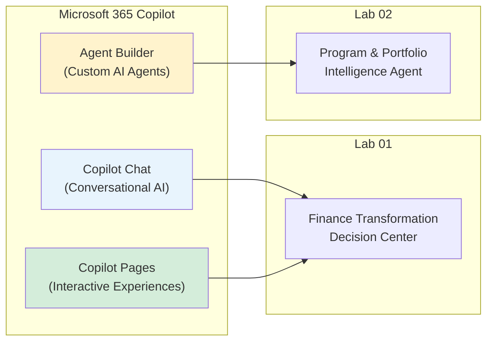
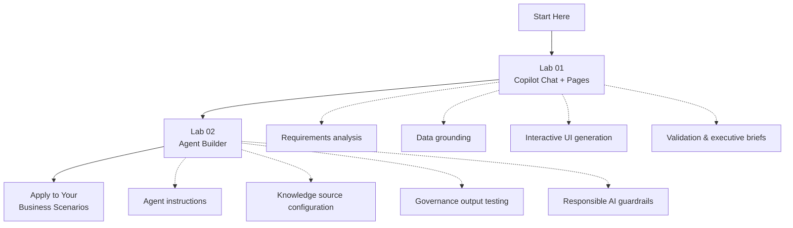

# Microsoft 365 Copilot — Hands-On Training Labs

This repository contains beginner-friendly, no-code lab exercises for business professionals learning to use **Microsoft 365 Copilot** in real enterprise scenarios. Each lab follows a structured workflow—from understanding business requirements to building, testing, and validating AI-assisted outputs with responsible AI practices.

---

## About Microsoft 365 Copilot

**Microsoft 365 Copilot** is an AI assistant embedded across Microsoft 365 apps and experiences. It uses large language models together with your organizational data—within Microsoft 365 permissions—to help you summarize, analyze, create, and act on business information using natural language.

Unlike a generic chatbot, Copilot is designed to work within the Microsoft 365 ecosystem, respecting existing access controls and grounding responses in the content you provide or that you are authorized to access.

### Key Capabilities

| Capability | Description |
|------------|-------------|
| **Summarization** | Condense long documents, emails, meetings, and datasets into executive-ready summaries |
| **Analysis** | Explore business data, identify patterns, and surface gaps in source information |
| **Creation** | Draft reports, briefs, checklists, and interactive experiences from requirements |
| **Grounding** | Connect responses to approved documents, spreadsheets, and organizational knowledge |
| **Agent Building** | Create purpose-built AI agents with instructions, knowledge sources, and guardrails |

### Copilot Experiences Used in These Labs

| Experience | Used In | Purpose |
|------------|---------|---------|
| **Copilot Chat** | Lab 01 | Analyze BRDs, datasets, and requirements through conversational prompts |
| **Copilot Pages** | Lab 01 | Generate an interactive Finance Transformation Decision Center |
| **Agent Builder** | Lab 02 | Build a grounded Program & Portfolio Intelligence Agent with knowledge sources |

---

## Lab Curriculum

| Lab | Title | Duration | Technology | Outcome |
|:---:|-------|:--------:|------------|---------|
| **01** | [Build a Finance Transformation Decision Center](lab01-finance-transformation-decision-center.md) | 60–75 min | Copilot Chat, Copilot Pages | Interactive executive dashboard from BRD + Excel data |
| **02** | [Build a Program & Portfolio Intelligence Agent](lab02-program-portfolio-intelligence-agent.md) | 60–75 min | Copilot Agent Builder | Grounded governance agent with RAID, actions, and financial views |

### Lab Progression

Lab 01 teaches a **six-phase consulting workflow** (Discover → Ground → Design → Build → Validate → Communicate) using Copilot Chat and Pages. Lab 02 extends that foundation with a **six-phase agent lifecycle** (Initialize → Configure → Test Core → Test Extended → Test Guardrails → Validate & Deliver) using Agent Builder. Together, they cover the two most common enterprise Copilot patterns: ad-hoc analysis with interactive output, and governed agent-based intelligence.

---

## Prerequisites

Before starting the labs, ensure you have:

- A **Microsoft work or school account** with Microsoft 365 Copilot licensing
- Access to **Copilot Chat** and **Copilot Pages** (Lab 01)
- Access to **Copilot Agent Builder** (Lab 02)
- A current version of **Microsoft Edge** (recommended) or **Google Chrome**
- Lab files provided by your trainer (see each lab for the file list)

> **Important:** Use only fictional or approved sanitized data. Do not use real confidential client information in training exercises.

---

## How to Use These Labs

Each lab follows a consistent structure:

1. **Lab Overview** — What you will build and why
2. **Learning Objectives** — Skills you will gain
3. **Business Context** — Use case, requirements, and rules
4. **Prerequisites & Lab Files** — What you need before starting
5. **Architecture / Workflow Diagrams** — Visual guide to the solution
6. **Exercises** — Step-by-step tasks with exact prompts
7. **Checkpoints** — Validation points throughout
8. **Final Checklist** — Confirm completion before finishing
9. **Key Takeaways** — Summary of responsible AI practices

### Recommended Approach

- Read the **Business Context** and **Business Rules** before starting exercises
- Follow exercises **in order**—each builds on the previous step
- Use the **exact prompts** provided, then adapt them for your own scenarios after the lab
- Always **validate AI output** against source documents before sharing with stakeholders
- Treat all AI-generated content as **draft requiring human review**

---

## Responsible AI Principles

Both labs reinforce enterprise-ready AI practices:

| Principle | Practice |
|-----------|----------|
| **Ground in source data** | Use approved documents and datasets; do not rely on AI memory alone |
| **Never invent missing data** | Display "Not provided" when information is unavailable |
| **Distinguish facts from observations** | Separate verified source facts from AI-generated interpretations |
| **Label proposed actions** | Mark AI suggestions as drafts requiring owner confirmation |
| **Expose conflicts** | Show conflicting source values rather than silently choosing one |
| **Require human review** | All governance and executive outputs need professional validation |
| **Respect permissions** | Agents and Copilot only access information the user is authorized to see |

---

## Lab Files (Trainer Reference)

Lab source files are not included in this repository. Trainers should prepare the following before delivery:

### Lab 01 Files

| File | Notes |
|------|-------|
| `Finance_Transformation_BRD.docx` | Business requirements with functional requirement IDs (FR-01, etc.) |
| `Finance_Transformation_Data.xlsx` | Fictional transformation initiative dataset with intentional gaps |

### Lab 02 Files (folder: `Program Portfolio Knowledge/`)

| File | Notes |
|------|-------|
| `Program_Portfolio_Intelligence_Agent_BRD.docx` | Agent requirements and acceptance criteria |
| `01_Program_Overview.docx` | Program context |
| `02_Project_Status_Updates.docx` | Status reports |
| `03_RAID_Register.xlsx` | Risks, issues, actions, dependencies |
| `04_Action_Register.xlsx` | Include several overdue actions |
| `05_Decision_Register.xlsx` | Decisions made and required |
| `06_Financial_Summary.xlsx` | Budget, actual, forecast, variance |
| `07_Steering_Committee_Minutes.docx` | Include one controlled date conflict |

For reproducible learner outcomes, the Lab 02 knowledge pack should intentionally include **one missing-data scenario**, **one conflicting-date scenario**, **several overdue actions**, **3–4 dependencies**, and representative RAID and financial values.

---

## Additional Resources

- [Microsoft 365 Copilot overview](https://www.microsoft.com/en-us/microsoft-365/copilot)
- [Get started with Microsoft 365 Copilot](https://support.microsoft.com/en-us/copilot-microsoft365)
- [Microsoft Copilot Studio documentation](https://learn.microsoft.com/en-us/microsoft-copilot-studio/)
- [Responsible AI at Microsoft](https://www.microsoft.com/en-us/ai/responsible-ai)

---

## License & Usage

These labs are intended for instructor-led and self-paced training. Adapt prompts and business scenarios for your organization's context while maintaining the responsible AI guardrails defined in each exercise.
