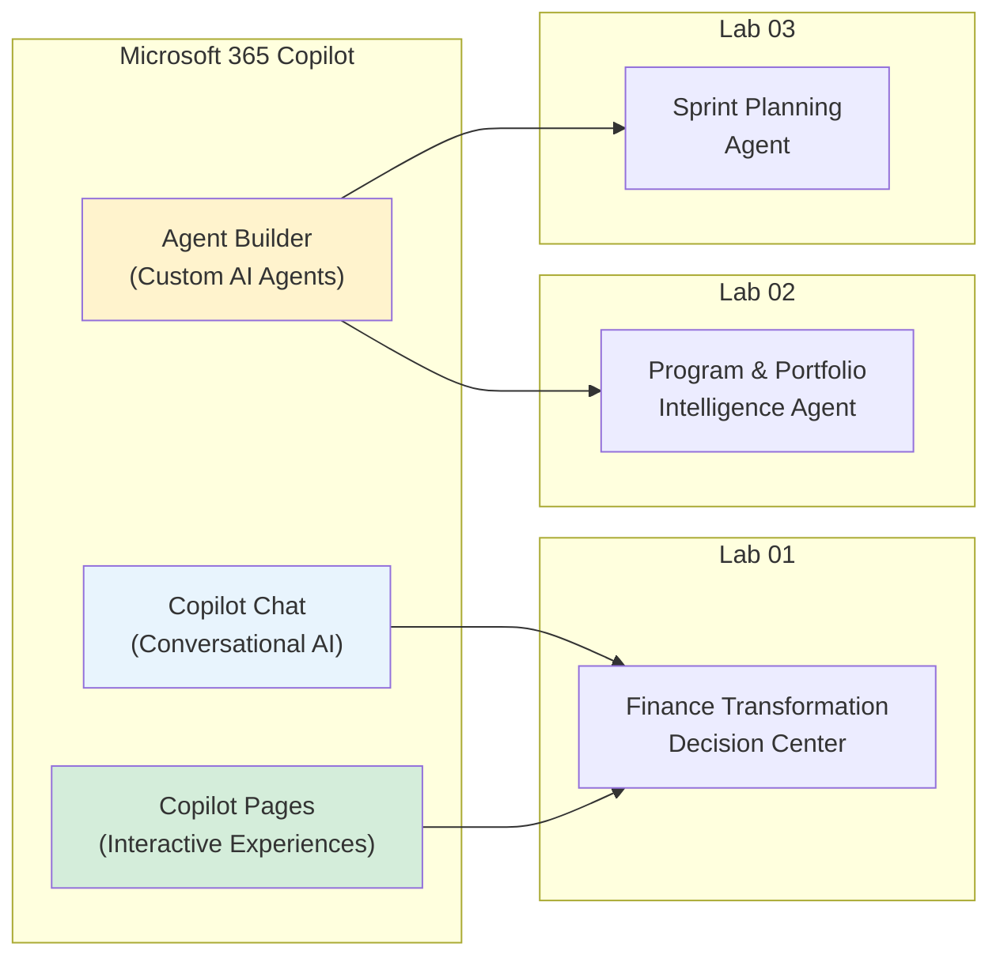
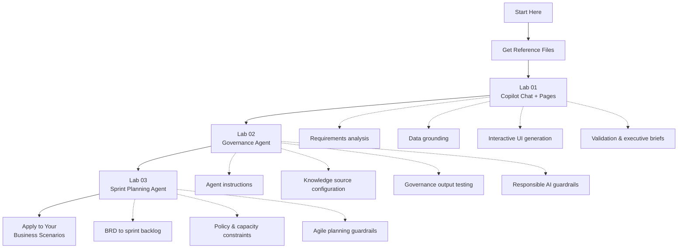

# Microsoft 365 Copilot — Hands-On Training Labs

This repository contains beginner-friendly, no-code lab exercises for business professionals learning to use **Microsoft 365 Copilot** in real enterprise scenarios. Each lab follows a structured workflow—from understanding business requirements to building, testing, and validating AI-assisted outputs with responsible AI practices.

**Everything needed to complete all three labs is included**—lab guides, reference data files, and a presentation overview.

---

## Repository Structure

```
training-m365-copilot/
├── README.md                          ← Start here
├── Labs/
│   ├── 01 - Finance-transformation-decision-center.md
│   ├── 02 - Program-portfolio-intelligence-agent.md
│   └── 03 - Sprint-planning-agent.md
├── Reference Files/                   ← Upload these into Copilot during labs
│   ├── Finance_Transformation_BRD.docx
│   ├── Finance_Transformation_Data.xlsx
│   ├── Program Portfolio Knowledge/   ← Lab 02
│   │   └── ...
│   └── Sprint Planning Knowledge/     ← Lab 03
│       ├── Sprint_Planning_Agent_BRD.docx
│       ├── Customer_Self_Service_Portal_BRD.docx
│       ├── Agile_Delivery_Policy.docx
│       ├── Scrum_Best_Practices_Guide.docx
│       ├── Team_Capacity_Planner.xlsx
│       └── Definition_of_Done.docx
├── Presentation/
│   └── Microsoft-365-Copilot.pdf
└── scripts/
    └── generate_reference_files.py    ← Regenerate reference files if needed
```

---

## About Microsoft 365 Copilot

**Microsoft 365 Copilot** is an AI assistant embedded across Microsoft 365 apps and experiences. It uses large language models together with your organizational data—within Microsoft 365 permissions—to help you summarize, analyze, create, and act on business information using natural language.

Unlike a generic chatbot, Copilot is designed to work within the Microsoft 365 ecosystem, respecting existing access controls and grounding responses in the content you provide or that you are authorized to access.

### Key Capabilities

| Capability | Description |
|------------|-------------|
| **Summarization** | Condense long documents, emails, meetings, and datasets into executive-ready summaries |
| **Analysis** | Explore business data, identify patterns, and surface gaps in source information |
| **Creation** | Draft reports, briefs, checklists, and interactive experiences from requirements |
| **Grounding** | Connect responses to approved documents, spreadsheets, and organizational knowledge |
| **Agent Building** | Create purpose-built AI agents with instructions, knowledge sources, and guardrails |

### Copilot Experiences Used in These Labs



| Experience | Used In | Purpose |
|------------|---------|---------|
| **Copilot Chat** | Lab 01 | Analyze BRDs, datasets, and requirements through conversational prompts |
| **Copilot Pages** | Lab 01 | Generate an interactive Finance Transformation Decision Center |
| **Agent Builder** | Lab 02, Lab 03 | Build grounded agents for governance and sprint planning |

---

## Lab Curriculum

| Lab | Title | Duration | Technology | Outcome |
|:---:|-------|:--------:|------------|---------|
| **01** | [Build a Finance Transformation Decision Center](Labs/01%20-%20Finance-transformation-decision-center.md) | 60–75 min | Copilot Chat, Copilot Pages | Interactive executive dashboard from BRD + Excel data |
| **02** | [Build a Program & Portfolio Intelligence Agent](Labs/02%20-%20Program-portfolio-intelligence-agent.md) | 60–75 min | Copilot Agent Builder | Grounded governance agent with RAID, actions, and financial views |
| **03** | [Build a Sprint Planning Agent](Labs/03%20-%20Sprint-planning-agent.md) | 60–75 min | Copilot Agent Builder | Sprint plan from BRD using policy, capacity, and Definition of Done |

### Lab Progression



| Lab | Workflow | What You Build |
|-----|----------|----------------|
| **01** | Discover → Ground → Design → Build → Validate → Communicate | Interactive Decision Center from BRD + data |
| **02** | Initialize → Configure → Test → Guardrails → Validate → Deliver | Program governance intelligence agent |
| **03** | Initialize → Configure → Plan → Capacity → Guardrails → Deliver | Sprint planning agent from product BRD |

Lab 01 teaches ad-hoc analysis with Copilot Chat and Pages. Labs 02 and 03 teach **Agent Builder** with different enterprise patterns—portfolio governance and agile sprint planning.

---

## Reference Files

All lab source files are included in the [`Reference Files`](Reference%20Files/) folder. Use the **exact file names** shown below when uploading into Copilot—they match the lab exercise instructions.

### Lab 01 — Finance Transformation Decision Center

| File | Location | Used In | Purpose |
|------|----------|---------|---------|
| `Finance_Transformation_BRD.docx` | `Reference Files/` | Exercises 1–2, 10 | Business requirements with FR-01 through FR-12 |
| `Finance_Transformation_Data.xlsx` | `Reference Files/` | Exercises 3–11 | 8 initiatives, 4 High Priority, intentional data gaps |

**Designed scenarios in the data:**

- 4 initiatives marked **High Priority** (supports Exercise 4 fact-checking)
- Missing benefit ranges, owners, and KPI baselines on selected records
- Filterable fields: Function, Status, Priority, Readiness
- Sortable fields: Initiative, Status, Cost, Target Date

### Lab 02 — Program & Portfolio Intelligence Agent

All files are in `Reference Files/Program Portfolio Knowledge/`.

| File | Used In | Purpose |
|------|---------|---------|
| `Program_Portfolio_Intelligence_Agent_BRD.docx` | Trainer reference | Agent requirements AR-01 through AR-10 |
| `01_Program_Overview.docx` | Exercise 5 | Horizon Transformation Program context |
| `02_Project_Status_Updates.docx` | Exercise 5 | Project Alpha/Beta/Gamma status |
| `03_RAID_Register.xlsx` | Exercise 5 | Risks, issues, assumptions, 4 dependencies |
| `04_Action_Register.xlsx` | Exercise 5 | 3 overdue actions (John Smith owns two) |
| `05_Decision_Register.xlsx` | Exercise 5 | Decisions made and required |
| `06_Financial_Summary.xlsx` | Exercise 5, 13 | Budget/actual/forecast — **no ROI data** |
| `07_Steering_Committee_Minutes.docx` | Exercise 5 | Governance minutes with controlled conflict |

**Designed scenarios:**

| Scenario | Detail | Tested In |
|----------|--------|-----------|
| Conflicting go-live date | 30 Nov vs 15 Dec for Project Alpha | Exercise 15 |
| Missing ROI | Not in financial records | Exercise 14 |
| Overdue actions | ACT-001, ACT-003, ACT-004 | Exercises 10–11 |

### Lab 03 — Sprint Planning Agent

All files are in `Reference Files/Sprint Planning Knowledge/` (same folder name referenced in the lab).

| File | Used In | Purpose |
|------|---------|---------|
| `Sprint_Planning_Agent_BRD.docx` | Trainer reference | Agent requirements SPR-01 through SPR-10 |
| `Customer_Self_Service_Portal_BRD.docx` | Exercise 5 | Product BRD with REQ-01 through REQ-12 |
| `Agile_Delivery_Policy.docx` | Exercise 5 | 2-week sprints, max 7 items, Fibonacci scale |
| `Scrum_Best_Practices_Guide.docx` | Exercise 5 | INVEST, story format, estimation guidance |
| `Team_Capacity_Planner.xlsx` | Exercise 5, 12 | Sprint 4 capacity: **34 story points** |
| `Definition_of_Done.docx` | Exercise 5, 13 | Story-level completion checklist |

**Designed scenarios:**

| Scenario | Detail | Tested In |
|----------|--------|-----------|
| **Missing acceptance criteria** | REQ-05 (Live chat), REQ-07 (Multi-language) | Exercises 11, 14 |
| **Conflicting defaults** | REQ-08 default Email vs REQ-09 default SMS | Exercise 15 |
| **Capacity limit** | 34 story points; max 7 backlog items | Exercises 12, 16 |
| **Could-have scope** | REQ-10, REQ-12 require PO confirmation | Exercise 17 |
| **No velocity history** | Historical velocity not in approved sources | Exercise 17 |
| **Must requirements** | REQ-01, 02, 03, 04, 06, 08, 09, 11 for sprint stories | Exercises 9–10 |

### How to Use Reference Files

1. Clone or download this repository.
2. Open the lab guide from the [`Labs/`](Labs/) folder.
3. When an exercise asks you to add a file, upload it from [`Reference Files/`](Reference%20Files/) using the exact name shown in the lab.
4. For Lab 02 and Lab 03 Exercise 5, add all knowledge files from the respective subfolder in the order listed in the lab.

> **Important:** All data is **fictional and sanitized** for training. Do not substitute real client or confidential information.

### Regenerating Reference Files

To recreate all reference files from source:

```bash
python scripts/generate_reference_files.py
```

Requires `python-docx` and `openpyxl`.

---

## Prerequisites

Before starting the labs, ensure you have:

- A **Microsoft work or school account** with Microsoft 365 Copilot licensing
- Access to **Copilot Chat** and **Copilot Pages** (Lab 01)
- Access to **Copilot Agent Builder** (Lab 02, Lab 03)
- A current version of **Microsoft Edge** (recommended) or **Google Chrome**
- Reference files from this repository (see [Reference Files](#reference-files) above)

---

## How to Use These Labs

Each lab follows a consistent structure:

1. **Lab Overview** — What you will build and why
2. **Learning Objectives** — Skills you will gain
3. **Business Context** — Use case, requirements, and rules
4. **Prerequisites & Lab Files** — What you need before starting
5. **Architecture / Workflow Diagrams** — Visual guide to the solution
6. **Exercises** — Step-by-step tasks with exact prompts
7. **Checkpoints** — Validation points throughout
8. **Final Checklist** — Confirm completion before finishing
9. **Key Takeaways** — Summary of responsible AI practices

### Recommended Approach

- Download or locate the **Reference Files** before starting
- Complete **Lab 01** first, then **Lab 02**, then **Lab 03** for the best learning progression
- Read the **Business Context** and **Business Rules** before starting exercises
- Follow exercises **in order**—each builds on the previous step
- Use the **exact prompts** provided, then adapt them for your own scenarios after the lab
- Always **validate AI output** against source documents before sharing with stakeholders
- Treat all AI-generated content as **draft requiring human review**

---

## Responsible AI Principles

All labs reinforce enterprise-ready AI practices:

| Principle | Practice |
|-----------|----------|
| **Ground in source data** | Use approved documents and datasets; do not rely on AI memory alone |
| **Never invent missing data** | Display "Not provided" when information is unavailable |
| **Distinguish facts from observations** | Separate verified source facts from AI-generated interpretations |
| **Label proposed actions** | Mark AI suggestions and estimates as drafts requiring confirmation |
| **Expose conflicts** | Show conflicting source values rather than silently choosing one |
| **Require human review** | All governance, planning, and executive outputs need professional validation |
| **Respect permissions** | Agents and Copilot only access information the user is authorized to see |

---

## Additional Resources

- [Microsoft 365 Copilot overview](https://www.microsoft.com/en-us/microsoft-365/copilot)
- [Get started with Microsoft 365 Copilot](https://support.microsoft.com/en-us/copilot-microsoft365)
- [Microsoft Copilot Studio documentation](https://learn.microsoft.com/en-us/microsoft-copilot-studio/)
- [Responsible AI at Microsoft](https://www.microsoft.com/en-us/ai/responsible-ai)
- [Presentation: Microsoft 365 Copilot overview](Presentation/Microsoft-365-Copilot.pdf)

---

## License & Usage

These labs are intended for instructor-led and self-paced training. Adapt prompts and business scenarios for your organization's context while maintaining the responsible AI guardrails defined in each exercise.
