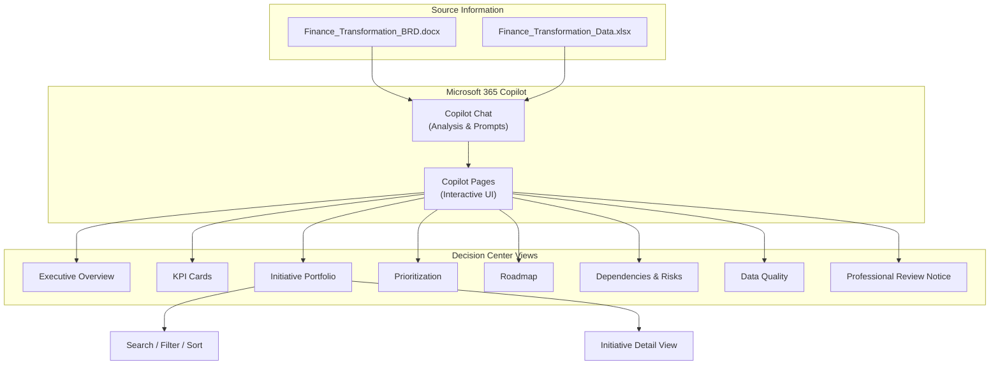

# Lab 01: Build a Finance Transformation Decision Center Using Microsoft 365 Copilot

| | |
|---|---|
| **Duration** | 60–75 minutes |
| **Level** | Beginner |
| **Audience** | Business Consultants, Finance Professionals, Analysts, Managers, Business Users |
| **Technology** | Microsoft 365 Copilot Chat, Copilot Pages |
| **Coding Required** | No |

---

## Lab Overview

In this hands-on lab, you use **Microsoft 365 Copilot** to turn business requirements and finance transformation data into an interactive **Finance Transformation Decision Center**.

You work as a business consultant supporting a finance transformation program. Instead of immediately asking Copilot to generate a solution, you follow a structured consulting workflow:

**Understand Requirements → Inspect Data → Analyze → Design → Build → Test → Refine → Validate → Communicate**

You learn how to use natural-language prompts with Microsoft 365 Copilot without writing application code. The final solution gives leadership an executive overview, initiative portfolio, prioritization information, roadmap, and data-quality information aligned with the supplied Business Requirements Document (BRD).

---

## Learning Objectives

After completing this lab, you will be able to:

- Start a business task using Microsoft 365 Copilot Chat
- Provide business documents and data as context
- Ask Copilot to understand a BRD
- Convert requirements into an implementation checklist
- Analyze an Excel dataset using natural language
- Distinguish facts, observations, and missing information
- Design a business solution before generating it
- Create an interactive experience using Copilot Pages
- Refine generated content using natural language
- Validate AI-generated output against original requirements
- Create an executive summary from the analysis
- Apply responsible AI practices when using business information

---

## Business Context

### Use Case: Finance Transformation Decision Center

Your organization is running a **Finance Transformation Program**. Information about transformation initiatives currently exists across spreadsheets and documents. Senior finance leadership needs a simpler way to review the transformation portfolio.

**Primary users:**

- CFO
- Finance Transformation Lead
- FP&A Lead
- Controller
- GBS Lead
- Process Owners
- Program Leadership

**Source information may include:**

- KPI baselines
- Pain points
- Transformation initiatives
- Estimated costs
- Benefit ranges
- Readiness
- Dependencies
- Risks
- Target dates

### Business Requirements

Leadership wants a **Finance Transformation Decision Center** that helps them:

- Understand the current transformation portfolio
- Review important KPIs
- Search transformation initiatives
- Filter and sort initiatives
- Review priorities
- Understand readiness
- Review dependencies and risks
- Understand the transformation roadmap
- Identify missing or incomplete information

The prototype supports leadership discussions. It is **not** an approved business case, forecast, or investment-decision system.

### Business Rules

Throughout the exercise, your solution must follow these rules:

**DO**

- Use supplied source information
- Clearly identify missing information
- Keep source facts distinguishable from AI-generated observations
- Use only fictional or approved sanitized data

**DO NOT**

- Invent missing costs, benefits, owners, dates, or dependencies
- Create unsupported numerical scores
- Present the prototype as an approved business case

The BRD requires unsupported information to be shown as **"Not provided"** or **"Not available from supplied data."**

---

## Prerequisites

### Microsoft 365 Access

- Microsoft work or school account
- Access to Microsoft 365 Copilot Chat
- Access to Copilot Pages
- OneDrive or SharePoint access

### Browser

Use a current version of:

- Microsoft Edge (recommended)
- Google Chrome

### Lab Files

Your trainer should provide:

| File | Description |
|------|-------------|
| `Finance_Transformation_BRD.docx` | Business requirements document |
| `Finance_Transformation_Data.xlsx` | Transformation initiative dataset |

> Do not use real confidential client data for this exercise.

---

## Expected Results

At the end of the lab, you will have:

### Finance Transformation Decision Center

Containing:

1. Executive Overview
2. KPI Cards
3. Initiative Portfolio
4. Search / Filter / Sort
5. Prioritization
6. Roadmap
7. Dependencies & Risks
8. Data Quality
9. Professional Review Notice

You will also produce a short **CFO Executive Brief**.

---

## Lab Workflow

The lab follows a structured consulting workflow from requirement to communication:

---

## Decision Center Architecture

The information architecture you design and build maps source data to executive-facing views:

---

## Lab Setup

### Step 1 — Open Microsoft 365 Copilot

1. Open Microsoft Edge or Chrome.
2. Navigate to [Microsoft 365 Copilot](https://m365.cloud.microsoft/chat).
3. Sign in using the work/school account provided for the lab.
4. Wait for the Microsoft 365 Copilot experience to load.
5. From the left navigation, select **Chat**.
6. Start a **New chat**.

**Checkpoint:** You should see a new Copilot conversation with a prompt box.

> **Do not ask Copilot to create the application yet.** First, help Copilot understand the business problem.

---

## Exercises

### Exercise 1 — Understand the Business Requirement

**Estimated time:** 8 minutes

#### Step 1 — Add the BRD

In Copilot Chat:

1. Locate the option for adding content/files near the prompt box.
2. Select the supplied `Finance_Transformation_BRD.docx`.
3. Wait until the document is available to the conversation.

#### Step 2 — Analyze the BRD

Copy and paste the following prompt:

> Review the attached Finance Transformation Business Requirements Document.
>
> Do not design or build anything yet.
>
> Explain the requirement in simple business language.
>
> Organize your response into:
>
> 1. Business problem
> 2. Business objectives
> 3. Primary users
> 4. Information required
> 5. Required capabilities
> 6. Important constraints
> 7. Expected output
> 8. Acceptance criteria
>
> Use only information available in the attached document.
>
> Do not invent additional requirements.

Press **Send**.

#### Step 3 — Review the Result

Verify that Copilot identifies:

- Finance transformation
- Leadership decision support
- Executive KPI overview
- Initiative portfolio
- Search/filter capabilities
- Prioritization
- Roadmap
- Data-quality requirements

**Checkpoint:** Does Copilot's interpretation match the supplied BRD? Do not continue until the business requirement is reasonably represented.

---

### Exercise 2 — Create the Requirements Checklist

**Estimated time:** 5 minutes

Remain in the **same Copilot conversation**. Enter:

> Based only on the supplied BRD, create an implementation checklist.
>
> Organize it into:
>
> MUST HAVE
> SHOULD HAVE
> MUST NOT DO
>
> Include the BRD requirement ID such as FR-01, FR-02 and so on wherever available.
>
> Do not introduce new requirements.

Press **Send**.

#### Review the Checklist

Pay particular attention to **MUST NOT DO**. The solution should not invent unsupported costs, benefits, dates, owners, dependencies, or scores.

**Learning point:** Copilot can convert a long business document into an **actionable checklist**, not just create content.

---

### Exercise 3 — Add the Finance Dataset

**Estimated time:** 10 minutes

Now that Copilot understands the requirement, provide the data.

#### Step 1 — Add the Workbook

Using the file/content option near the prompt box, add `Finance_Transformation_Data.xlsx`. Wait until the workbook is available.

#### Step 2 — Ask Copilot to Understand the Data

Enter:

> Inspect the attached Finance Transformation dataset.
>
> Do not build the application yet.
>
> Map the available dataset fields against the BRD requirements.
>
> Create a table containing:
>
> BRD Requirement | Required Information | Available Dataset Field | Available? | Notes
>
> After the table, identify:
>
> 1. Information available
> 2. Information partially available
> 3. Information missing
> 4. Data-quality concerns
>
> Do not infer or create missing values.

Press **Send**.

#### Step 3 — Review the Mapping

Identify which BRD requirements can actually be implemented from the supplied data.

**Checkpoint:** You should now be able to answer:

- What does leadership want?
- What data do we actually have?

This aligns with **FR-01** in the BRD: inspect the dataset and map available columns before building the solution.

---

### Exercise 4 — Analyze the Business Data

**Estimated time:** 8 minutes

Enter:

> Analyze the supplied Finance Transformation data from a leadership perspective.
>
> Identify:
>
> * Portfolio size
> * Initiative distribution
> * Current status
> * High-priority initiatives, if explicitly identified
> * Investment information
> * Benefit information
> * Readiness
> * Important dependencies
> * Risks
> * Target dates
>
> Organize your response into three sections:
>
> FACTS — directly supported by the data
>
> OBSERVATIONS — patterns visible in the supplied data
>
> INFORMATION GAPS — information that cannot be determined
>
> Do not invent missing information.
>
> Do not make investment recommendations.

Press **Send**.

#### Review the Result

Notice the difference between:

**FACT:** 4 initiatives are marked High Priority.

**INTERPRETATION:** High-priority initiatives should receive investment first.

The second statement requires business judgment and potentially additional information.

---

### Exercise 5 — Challenge Copilot

**Estimated time:** 5 minutes

Intentionally ask a difficult business question:

> Which initiative should the CFO approve first?

Review the response. Then enter:

> Do we have sufficient source information to make that decision?
>
> Separate:
>
> * Evidence available
> * Evidence missing
> * Assumptions that would be required
>
> Do not select or rank an initiative.

**Learning point:** Copilot can support a decision but should not automatically **become the decision maker**.

---

### Exercise 6 — Design the Decision Center

**Estimated time:** 7 minutes

Before generating anything, design it. Enter:

> Based on the BRD and supplied dataset, design the information architecture for a Finance Transformation Decision Center.
>
> Do not generate code yet.
>
> The audience is CFO and Finance Leadership.
>
> Consider:
>
> * Executive Overview
> * Initiative Portfolio
> * Prioritization
> * Transformation Roadmap
> * Dependencies and Risks
> * Specialist finance views only where supported
> * Data Quality
>
> For each section explain:
>
> 1. What should be displayed
> 2. Which source information supports it
> 3. Which user interaction would be useful
>
> Do not include unsupported information.

Press **Send**.

#### Refine the Design

Enter:

> Simplify the proposed design for an executive audience.
>
> The first screen should quickly answer:
>
> 1. Where are we?
> 2. What requires attention?
> 3. What initiatives are underway?
> 4. What dependencies or risks exist?
> 5. What information is missing?
>
> Avoid unnecessary complexity.

**Checkpoint:** Review the proposed structure before continuing.

---

### Exercise 7 — Build the Decision Center

**Estimated time:** 15 minutes

Enter the following prompt:

> Create an interactive lightweight app called **Finance Transformation Decision Center**.
>
> Use only the attached BRD and Finance Transformation dataset.
>
> The app is intended for CFO and Finance Transformation leadership.
>
> Include:
>
> 1. Executive Overview
> 2. KPI cards only for metrics supported by source data
> 3. Searchable Initiative Portfolio
> 4. Filters using relevant source-backed categories such as function, status, priority and readiness
> 5. Sortable initiative table
> 6. Initiative detail view
> 7. Prioritization view using only explicit source fields
> 8. Transformation Roadmap using explicit target-date or timing information
> 9. Dependencies and Risks view where supported
> 10. Data Quality section
> 11. Professional Review notice
>
> Important rules:
>
> * Never invent missing values.
> * Display "Not provided" when information is unavailable.
> * Do not create unsupported scores.
> * Do not invent costs, benefits, owners, dates or dependencies.
> * Clearly distinguish source facts from generated observations.
> * Keep the UI professional and executive-friendly.
> * Do not use external dependencies.
>
> Generate the interactive UI so that I can preview it.

Press **Send**.

---

### Exercise 8 — Preview and Test the Application

Once Copilot finishes generating the interactive experience:

1. Locate the generated **Page**.
2. Open the generated Page if it is not already displayed.
3. Look for the **Preview** option.
4. Select **Preview**.

The interactive Decision Center should now appear.

#### Test 1 — Executive Overview

Review the KPI cards. Ask:

- Are the values supported by the dataset?
- Are labels understandable?
- Has Copilot created anything unsupported?

#### Test 2 — Search

Use the Initiative Portfolio search. Search for one of the initiative names.

**Expected result:** Only matching information should appear.

#### Test 3 — Filters

Try available filters such as Function, Status, Priority, and Readiness. Only test filters supported by the supplied dataset.

#### Test 4 — Sorting

Try sorting available columns (for example, Initiative, Status, Cost, Target date) where those fields exist.

#### Test 5 — Initiative Details

Open one initiative and compare its information with the Excel source.

**Checkpoint:** Information displayed should be traceable to the source dataset or clearly marked unavailable.

---

### Exercise 9 — Improve the Application

**Estimated time:** 8 minutes

Return to your Copilot conversation. You do not need to manually edit code.

**Improvement 1:**

> Make the Executive Overview easier for a CFO to scan.
>
> Reduce visual clutter and emphasize the most important source-backed metrics.
>
> Do not add new metrics.

**Improvement 2:**

> Add a clear visual indicator for records with important missing information.
>
> Do not infer or populate the missing information.

**Improvement 3:**

> Improve the Transformation Roadmap so leadership can distinguish near-term and later initiatives.
>
> Use only timing information explicitly available in the dataset.

**Improvement 4:**

> Improve the Initiative Portfolio so search, filters and sorting are easy to find while keeping the interface clean and executive-friendly.

**Learning point:** You used the pattern **Generate → Preview → Evaluate → Refine** without manually changing application code.

---

### Exercise 10 — Validate Against the Original Requirement

**Estimated time:** 7 minutes

Enter:

> Act as a business acceptance reviewer.
>
> Compare the current Finance Transformation Decision Center against the original BRD.
>
> Create a table containing:
>
> Requirement ID | Requirement | Status | Evidence | Gap
>
> Use the following status values:
>
> PASS
> PARTIAL
> FAIL
>
> Do not mark a requirement PASS unless the current prototype actually satisfies it.
>
> Finally, list the five most important items requiring human review.

Press **Send**.

#### Acceptance Check

Your solution should be checked for:

- Source-backed information
- Search, filters, and sorting
- Drill-down
- KPI reconciliation
- Data-quality handling
- Professional-review notice

---

### Exercise 11 — Create the CFO Executive Brief

**Estimated time:** 5 minutes

Enter:

> Based on the supplied data, our analysis and the Decision Center, create a one-page executive brief for the CFO.
>
> Include:
>
> * Transformation portfolio overview
> * Most important source-backed observations
> * Key risks and dependencies
> * Important data-quality gaps
> * Areas requiring leadership discussion
>
> Clearly distinguish facts from observations.
>
> Do not make an investment recommendation.
>
> Keep the brief concise and suitable for a senior executive.

Press **Send** and review the result.

---

## Final Validation Checklist

Before completing the lab, confirm each item:

| Done | Activity |
|:----:|----------|
| ☐ | Opened Microsoft 365 Copilot Chat |
| ☐ | Added the BRD |
| ☐ | Understood the business requirement |
| ☐ | Created a requirements checklist |
| ☐ | Added the Excel dataset |
| ☐ | Mapped data against requirements |
| ☐ | Identified facts, observations, and gaps |
| ☐ | Designed the Decision Center |
| ☐ | Generated the interactive experience |
| ☐ | Previewed the application |
| ☐ | Tested search, filters, and sorting |
| ☐ | Verified source-backed values |
| ☐ | Improved the application using prompts |
| ☐ | Validated the result against the BRD |
| ☐ | Created the CFO Executive Brief |

---

## Key Takeaways

You followed an end-to-end business consulting workflow:

**Business Requirement → Understand → Ground with Data → Analyze → Identify Gaps → Design → Generate → Preview → Test → Refine → Validate → Communicate**

> **The quality of AI-assisted work depends not only on the prompt, but also on the quality of the context, source information, validation, and human judgment.**
